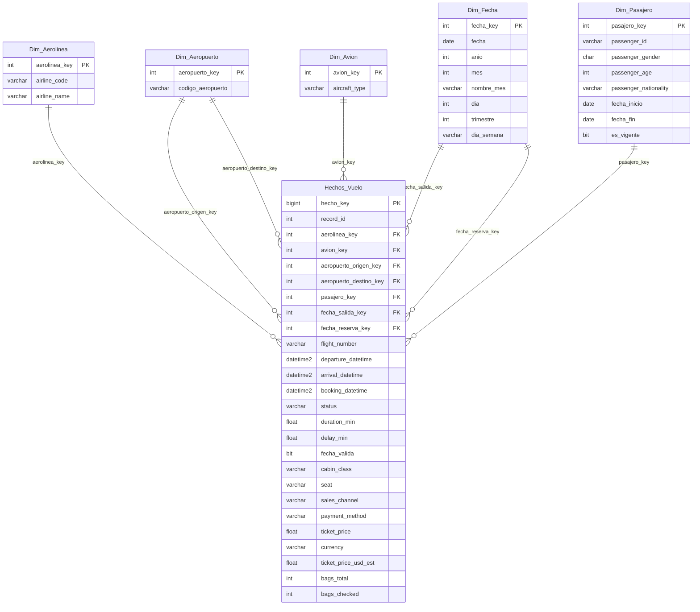

# Práctica 1: ETL con Python: de dataset crudo a tabla relacional lista para análisis

**Universidad San Carlos de Guatemala**  
**Facultad de Ingeniería**  
**Escuela de Ciencias y Sistemas**  
**Curso:** Seminario de Sistemas 2  
**Repositorio:** `SS22S2026_G8`  
**Carpeta:** `Practica1`  

---

## 1. Descripción General

El presente proyecto implementa un flujo de trabajo **ETL (Extract, Transform, Load)** automatizado en Python utilizando la librería `pandas` para procesar y estandarizar un conjunto de datos crudos sobre vuelos comerciales (`dataset_vuelos_crudo.csv`). Los datos transformados se cargan en una base de datos relacional/multidimensional en **Microsoft SQL Server** configurada bajo un esquema en estrella (*Star Schema*).

Además, el modelo implementa una dimensión **SCD Tipo 2 (Slowly Changing Dimension Type 2)** en la tabla de pasajeros (`Dim_Pasajero`) para conservar el historial de cambios, y proporciona un conjunto completo de **consultas SQL analíticas** para auditar la carga y generar indicadores clave de negocio (KPIs).

---

## 2. Arquitectura del Sistema

```
┌───────────────────────────────┐
│   dataset_vuelos_crudo.csv    │ (Fuente Heterogénea / Dataset Crudo)
└───────────────┬───────────────┘
                │
                ▼
┌───────────────────────────────┐
│     Extracción (Pandas)       │ Lectura e inspección inicial de tipos/nulos
└───────────────┬───────────────┘
                │
                ▼
┌───────────────────────────────┐
│  Transformación y Limpieza    │ - Normalización de fechas flexibles (DD/MM/YYYY y MM-DD-YYYY)
│          (Python)             │ - Homologación de nombres de aerolíneas y aeropuertos
│                               │ - Imputación de nulos y estandarización de géneros (M, F, X)
│                               │ - Validación de reglas de negocio (duración, maletas, precios)
└───────────────┬───────────────┘
                │
                ▼
┌───────────────────────────────┐
│      Carga (pyodbc Bulk)      │ Carga en modelo multidimensional de SQL Server
└───────────────┬───────────────┘
                │
                ▼
┌───────────────────────────────┐
│  Modelo Multidimensional BD   │ - Hechos_Vuelo (Fact Table)
│         (SQL Server)          │ - Dim_Aerolinea, Dim_Aeropuerto, Dim_Avion, Dim_Fecha
│                               │ - Dim_Pasajero (SCD Tipo 2)
└───────────────────────────────┘
```

---

## 3. Modelo Multidimensional (Esquema en Estrella)

El modelo está estructurado en un **Esquema en Estrella (Star Schema)** donde la tabla de hechos central `Hechos_Vuelo` almacena las métricas cuantitativas del negocio y se conecta con 5 dimensiones mediante claves foráneas.

### Diagrama Entidad-Relación (Mermaid)



### Implementación de Dimensión SCD Tipo 2
La dimensión `Dim_Pasajero` cuenta con las columnas:
- `fecha_inicio`: Fecha desde la cual el registro del pasajero es válido.
- `fecha_fin`: Fecha de expiración del registro (NULL si la versión se encuentra activa).
- `es_vigente`: Bandera booleana (`1` si el registro es el activo, `0` en caso de histórico).

---

## 4. Diagnóstico y Corrección del Error de Carga

Al revisar el código y la definición de base de datos entregada previamente, se identificaron y corrigieron **3 fallos críticos** que impedían la ejecución exitosa de la carga:

1. **Truncamiento de Cadena en `Dim_Pasajero` (`db.sql`)**:
   - **Causa:** La columna `passenger_id` en `db.sql` estaba definida como `VARCHAR(20)`. Sin embargo, el dataset contiene identificadores UUID de 36 caracteres (ej. `77e21f8e-6e79-4504-905f-636cea932c06`), lo que provocaba un error de truncamiento `String or binary data would be truncated`.
   - **Solución:** Se actualizó `db.sql` ampliando el tamaño a `VARCHAR(50)`.

2. **Incompatibilidad de Tipos `float64` a `BIT` en `main.py`**:
   - **Causa:** La columna `fecha_valida` se transformaba mediante `.map({True: 1, False: 0})`. Debido a la presencia de valores nulos (vuelos cancelados), Pandas convertía la columna a tipo flotante (`1.0`, `0.0`, `NaN`). Al intentar enviar un número flotante a una columna SQL de tipo `BIT`, `pyodbc` rechazaba el parámetro.
   - **Solución:** Se implementó la función auxiliar `to_bit(val)` que mapea explícitamente a enteros Python `1`, `0` o `None` de forma segura.

3. **Manejo de Objeto `pd.NaT` y `np.nan` en `pyodbc` (`main.py`)**:
   - **Causa:** Al iterar sobre el DataFrame para generar tuplas de inserción, los valores nulos en columnas de fecha se mantenían como instancias `pd.NaT`. `pyodbc` no traduce `pd.NaT` automáticamente a `NULL` de SQL Server, generando excepciones de conversión.
   - **Solución:** Se añadió la función `clean_val()` que convierte `pd.NaT` y `np.nan` a `None` nativo de Python y formatea instancias de `Timestamp` a `datetime` estándar.

4. **Optimización de Carga Masiva**:
   - **Solución:** Se habilitó `cursor.fast_executemany = True` con bloque `try/except` de diagnóstico para reducir el tiempo de carga de minutos a segundos.

---

## 5. Estructura de Archivos del Proyecto

```
PRACTICA1/
├── connection.py            # Configuración y obtención de conexión pyodbc a SQL Server
├── db.sql                   # Script DDL para creación de Base de Datos y Tablas
├── main.py                  # Script principal ETL (Extracción, Transformación y Carga)
├── consultas.sql            # Script con consultas SQL analíticas e indicadores (35 pts)
├── dataset_vuelos_crudo.csv # Archivo fuente de datos crudos
├── README.md                # Documentación técnica del proyecto
└── requirements.txt         # Librerías requeridas (pandas, pyodbc, etc.)
```

---

## 6. Guía de Ejecución

### Requisitos Previos
1. Python 3.10 o superior.
2. Microsoft SQL Server (2019 o superior / Express / Developer Edition).
3. Driver ODBC 18 para SQL Server instalado en el sistema operativo.

### Instalación de Dependencias
```bash
pip install -r requirements.txt
```

### Paso 1: Creación de la Base de Datos en SQL Server
Abra SQL Server Management Studio (SSMS) o la extensión de SQL Server en VS Code y ejecute el contenido de `db.sql`:
```sql
-- Ejecutar db.sql en SQL Server
```

### Paso 2: Configurar Parámetros de Conexión
Edite el archivo `connection.py` ajustando el nombre de su servidor local de SQL Server si es necesario:
```python
server = r"SU_SERVIDOR\SQLEXPRESS"  # Modificar si su instancia difiere
database = "SS22S2026_G8"
```

### Paso 3: Ejecutar el Proceso ETL
Corra el script principal en la consola de comandos:
```bash
python main.py
```
El script mostrará la bitácora de dimensiones procesadas, validación de nulos y el total de registros insertados en `Hechos_Vuelo`.

### Paso 4: Ejecución de Consultas Analíticas
Ejecute el archivo `consultas.sql` en SQL Server para verificar los datos cargados y obtener reportes e indicadores.

---

## 7. Consultas Analíticas (`consultas.sql`)

El archivo `consultas.sql` contiene 6 secciones diseñadas para responder a preguntas de negocio e inspeccionar la calidad de datos:

1. **Sección 1: Validación de Carga e Integridad de Datos** (conteos, auditoría de la regla de negocio `fecha_valida` e integridad referencial).
2. **Sección 2: Indicadores Clave de Rendimiento (KPIs)** (vuelos por estado, ingresos totales en USD, tiempos promedio de vuelo y retraso).
3. **Sección 3: Análisis de Destinos y Aerolíneas** (Top 5 aeropuertos destino, Top 5 aerolíneas por volumen y recaudación, rutas más frecuentadas).
4. **Sección 4: Análisis Demográfico y Comportamiento del Pasajero** (distribución por género, edad promedio por clase de cabina, Top 5 nacionalidades, verificación SCD Tipo 2).
5. **Sección 5: Canales de Venta y Métodos de Pago** (ingresos por canal, métodos de pago según moneda, promedios de equipaje).
6. **Sección 6: Análisis Temporal** (volumen de vuelos e ingresos por trimestre/mes, comportamiento de retrasos según el día de la semana).
