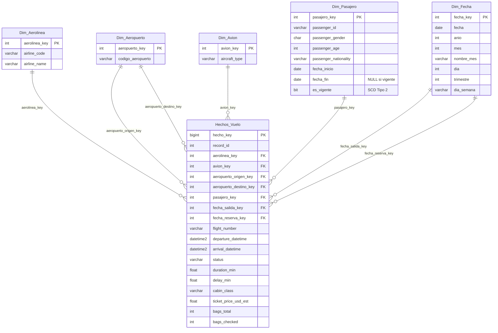

# Práctica 1 — ETL con Python: de dataset crudo a tabla relacional lista para análisis

Seminario de Sistemas 2 — Universidad San Carlos de Guatemala

## 1. Descripción del proceso ETL

El proyecto implementa un proceso ETL (Extracción, Transformación y Carga) en Python que toma
un dataset crudo de registros de vuelos (`dataset_vuelos_crudo.csv`, 10,000 filas) y lo deja
listo para análisis en un modelo multidimensional (esquema estrella) en SQL Server.

### 2.1 Extracción
- Lectura del CSV con `pandas` (`main.py`, sección `EXTRACT`).
- Diagnóstico inicial: dimensiones, tipos de dato, nulos y duplicados.

### 2.2 Transformación
- Relleno de nulos: `passenger_age` con la mediana, `passenger_nationality` y `sales_channel`
  con `'DESCONOCIDO'`.
- Normalización de `passenger_gender` a `{M, F, X}`.
- Normalización de códigos de aeropuerto a mayúsculas.
- Homologación de `airline_name` por `airline_code` (se usa el nombre más frecuente por
  código, ya que el crudo trae variantes de escritura para la misma aerolínea).
- Parseo flexible de fechas (`departure_datetime`, `arrival_datetime`, `booking_datetime`),
  ya que el dataset mezcla dos formatos (`dd/mm/aaaa HH:MM` y `mm-dd-aaaa hh:mm AM/PM`).
- Recalculo de `duration_min` a partir de las fechas parseadas y detección de duraciones
  inconsistentes (negativas o mayores a 24h), marcadas con la bandera `fecha_valida`.
- Normalización de `ticket_price` (coma decimal a punto) y validación de que no existan
  precios ≤ 0.
- Corrección de valores negativos en columnas que no admiten negativos
  (`duration_min`, `delay_min`, `passenger_age`, `bags_total`, `bags_checked`).
- Validación de consistencia `bags_checked <= bags_total`.

### 2.3 Carga
- Conexión a SQL Server vía `pyodbc` (`connection.py`, driver ODBC 18, autenticación
  integrada de Windows).
- Carga de las dimensiones `Dim_Aerolinea`, `Dim_Aeropuerto`, `Dim_Avion`, `Dim_Fecha` y
  `Dim_Pasajero` (ver historización SCD tipo 2 abajo), obteniendo los mapeos de llave
  subrogada por atributo natural.
- Carga de la tabla de hechos `Hechos_Vuelo`, resolviendo cada llave foránea contra los
  mapeos anteriores.
- Cada corrida reinicia (`DELETE` + `RESEED`) todas las dimensiones y la tabla de hechos,
  **excepto `Dim_Pasajero`**, que preserva su historial entre corridas (ver siguiente
  sección).

## 2. Modelo multidimensional

Esquema estrella con una tabla de hechos (`Hechos_Vuelo`) y cinco dimensiones. La dimensión
`Dim_Pasajero` es de **tipo 2 (SCD2)**: conserva versiones históricas de un pasajero cuando
cambia alguno de sus atributos descriptivos (género, edad, nacionalidad), mediante
`fecha_inicio`, `fecha_fin` y `es_vigente`.



### Lógica SCD Tipo 2 (`Dim_Pasajero`)

En cada corrida del ETL, por cada pasajero del origen se compara su versión vigente
(`es_vigente = 1`) contra los valores actuales de `passenger_gender`, `passenger_age` y
`passenger_nationality`:

- **Pasajero nuevo** → se inserta una versión con `fecha_inicio` = fecha de reserva,
  `fecha_fin = NULL`, `es_vigente = 1`.
- **Pasajero existente sin cambios** → no se modifica nada.
- **Pasajero existente con algún atributo distinto** → se expira la versión anterior
  (`es_vigente = 0`, `fecha_fin` = fecha del nuevo evento) y se inserta una nueva versión
  vigente. Así se conserva el historial completo de cambios en lugar de sobreescribirlo.

La tabla de hechos siempre enlaza contra la versión vigente del pasajero al momento de la
carga (`map_pasajero`, construido tras aplicar la historización).

## 3. Cómo ejecutar

```bash
pip install -r requirements.txt
```

1. Ejecutar `db.sql` en SQL Server para crear la base de datos `SS22S2026_G8` y las tablas.
2. Ajustar `connection.py` si el nombre del servidor/instancia difiere de
   `DESKTOP-91F9CRE\SQLEXPRESS`.
3. Ejecutar el proceso ETL:

```bash
python main.py
```

4. Ejecutar `consultas_analiticas.sql` contra la base `SS22S2026_G8` para validar la carga y
   obtener los indicadores analíticos.

## 4. Resultados y validación

`main.py` imprime en consola cada etapa del diagnóstico y de la carga: filas/columnas leídas,
nulos y duplicados detectados, aerolíneas/aeropuertos/aviones/fechas/pasajeros cargados, y el
detalle de versiones nuevas/expiradas de `Dim_Pasajero` en cada corrida.

`consultas_analiticas.sql` contiene:
- Consultas de **validación de carga** (conteo por tabla, integridad referencial de
  `Hechos_Vuelo` contra sus dimensiones, verificación de que ningún pasajero tenga más de una
  versión vigente).
- Consultas de **indicadores analíticos**: vuelos por estado, top 5 destinos, top 5 rutas,
  distribución de pasajeros por género, top 5 nacionalidades, vuelos y precio promedio por
  aerolínea, retraso promedio por aerolínea, vuelos por mes/trimestre, canal de venta y método
  de pago más usados, e ingreso total estimado por clase de cabina.

## 5. Estructura de archivos

```
PRACTICAS/PRACTICA1/
├── dataset_vuelos_crudo.csv     # fuente de datos cruda
├── db.sql                       # DDL del modelo multidimensional (SQL Server)
├── connection.py                # conexión a SQL Server (pyodbc)
├── main.py                      # proceso ETL (extracción, transformación, carga)
├── consultas_analiticas.sql     # consultas de validación e indicadores analíticos
├── requirements.txt             # dependencias de Python
└── README.md                    # este documento
```
