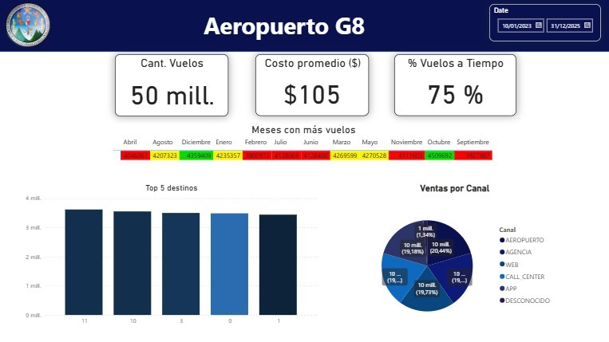
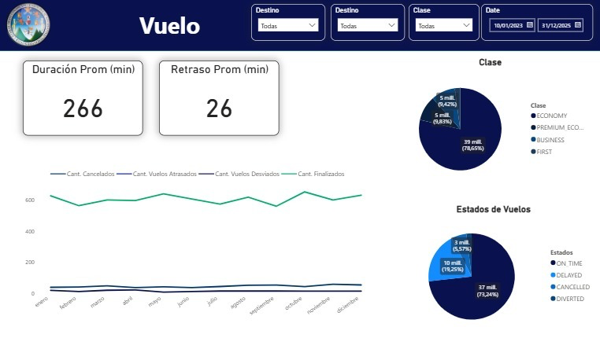
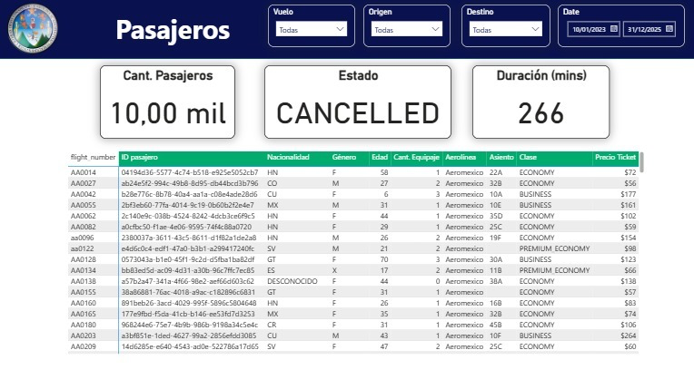

# Universidad de San Carlos de Guatemala
## Facultad de Ingeniería
### Escuela de Ciencias y Sistemas
### Seminario de Sistemas 2 — Segundo Semestre 2026

---

# INFORME TÉCNICO — PRÁCTICA 2
## DISEÑO DE DASHBOARD Y KPIS CON POWER BI

**Proyecto:** Cuadro de Mando Integral — Operaciones Aeropuerto (Grupo 8)  
**Grupo de Laboratorio:** Grupo 8  
**Herramientas:** Microsoft Power BI Desktop, Microsoft SQL Server, DAX  
**Fecha de Entrega:** Septiembre de 2026  

---

## ÍNDICE GENERAL

1. **MARCO FORMATIVO**
   * 1.1 Valor Aplicado
   * 1.2 Competencias Desarrolladas
   * 1.3 Planificación de Objetivos SMART
2. **ENUNCIADO Y ALCANCE DE LA PRÁCTICA**
   * 2.1 Descripción del Problema
   * 2.2 Alcance y Requerimientos Técnicos
   * 2.3 Arquitectura de la Solución
3. **MODELO TABULAR Y RELACIONES**
   * 3.1 Estructura del Esquema en Estrella
   * 3.2 Catálogo de Tablas y Relaciones
   * 3.3 Jerarquías Implementadas
4. **MEDIDAS Y KPIS CON DAX**
   * 4.1 Medida Principal de Puntualidad (OTP)
   * 4.2 Medidas de Desglose Operativo
   * 4.3 Tabla Resumen de Fórmulas e Indicadores
5. **VISTAS DEL DASHBOARD INTERACTIVO**
   * 5.1 Vista 1: General (Aeropuerto G8)
   * 5.2 Vista 2: Vuelo (Operaciones y Puntualidad)
   * 5.3 Vista 3: Pasajeros (Manifiesto Transaccional)
6. **INTERPRETACIÓN DE RESULTADOS Y TOMA DE DECISIONES**
   * 6.1 Eficiencia Operativa y Puntualidad
   * 6.2 Estacionalidad de la Demanda
   * 6.3 Canales de Venta y Cabinas
7. **ESTRUCTURA DE ARCHIVOS Y RÚBRICA DE CALIFICACIÓN**
   * 7.1 Archivos Entregables en el Repositorio
   * 7.2 Matriz de Cumplimiento de la Rúbrica Oficial

---

## 1. MARCO FORMATIVO

### 1.1 Valor Aplicado
* **Responsabilidad académica y profesional:** Se aplica mediante el compromiso técnico en la conexión directa a la base de datos SQL Server, la verificación exhaustiva de los cálculos en DAX y la elaboración transparente de visualizaciones que reflejan la realidad de las operaciones aeroportuarias sin alteraciones.

### 1.2 Competencias Desarrolladas
* **Competencia General:** Interpreta información proveniente de grandes volúmenes de datos mediante técnicas de visualización y comunicación clara con el propósito de apoyar procesos de toma de decisiones estratégicas.
* **Competencias Específicas:**
  * Crea modelos analíticos y soluciones de interpretación aplicando metodologías de análisis y ciclo de vida de datos en entornos de inteligencia empresarial.
  * Evalúa la calidad y pertinencia de la información empleando criterios de validez y confiabilidad para fundamentar decisiones mediante indicadores de desempeño (KPIs).

### 1.3 Planificación de Objetivos SMART

| Elemento SMART | Definición | Aplicación Práctica |
|---|---|---|
| **Específico (¿Qué?)** | Concreto y tangible | Conectar Power BI a la base de datos `SS22S2026_G8` (SQL Server), construir un modelo tabular con relaciones y jerarquías, y diseñar un dashboard interactivo de 3 páginas con KPIs. |
| **Medible (¿Cuánto?)** | Medida objetiva de éxito | Creación de 3 páginas navegables (`GENERAL`, `VUELO`, `PASAJEROS`), 11+ visualizaciones dinámicas, 5 medidas DAX con semáforo KPI y segmentadores funcionales. |
| **Alcanzable (¿Cómo?)** | Factible con recursos disponibles | Uso de Microsoft Power BI Desktop conectado en modo importación al motor local SQL Server, utilizando los 10,000 registros depurados en la Práctica 1. |
| **Realista (¿Para qué?)** | Aporte al negocio | Facilitar la identificación de retrasos, temporadas pico, rutas más demandadas y eficiencia comercial en los canales de venta del aeropuerto. |
| **A Tiempo (¿Cuándo?)** | Cumplimiento del cronograma | Entrega en la Semana 7 del cronograma del segundo semestre de 2026. |

---

## 2. ENUNCIADO Y ALCANCE DE LA PRÁCTICA

### 2.1 Descripción del Problema
Las organizaciones del sector aeronáutico manejan un alto volumen de información diaria sobre vuelos, tripulaciones, aeronaves, equipajes y pasajeros. Contar con estos datos en tablas relacionales resulta insuficiente para la toma de decisiones ágiles. Esta práctica aborda la necesidad de transformar dichos datos en un modelo analítico interactivo que permita visualizar indicadores clave de desempeño (KPIs) para la gestión del "Aeropuerto G8".

### 2.2 Alcance y Requerimientos Técnicos
* **Obligatorio cumplido:** Conexión a SQL Server, modelo tabular con relaciones 1:N, jerarquía de fechas en la dimensión tiempo, al menos 3 medidas DAX y un KPI con semáforo visual, dashboard interactivo con gráficos de barras, líneas, tarjetas y segmentadores, e informe explicativo.
* **Recomendaciones adicionales incorporadas:** Medidas DAX avanzadas (OTP, promedios de demora, desglose por cuatro estados de vuelo), encabezados personalizados institucionales y manifiesto transaccional detallado.

### 2.3 Arquitectura de la Solución
El flujo de trabajo se divide en tres capas secuenciales:
1. **Capa de Almacenamiento Relacional (SQL Server):** Base de datos `SS22S2026_G8` con la tabla `Hechos_Vuelo` y dimensiones normalizadas resultantes del proceso ETL en Python.
2. **Capa Semántica y Modelado (Power BI Desktop):** Modelo tabular en estrella con relaciones de integridad referencial, jerarquías de fechas y tabla aislada `Medidas` con lógica DAX.
3. **Capa de Presentación Ejecutiva:** Dashboard de tres páginas temáticas interactivas con filtros sincronizados.

---

## 3. MODELO TABULAR Y RELACIONES

### 3.1 Estructura del Esquema en Estrella
El modelo tabular se compone de una tabla central de hechos y cinco dimensiones relacionales:
* **`Hechos_Vuelo` (Tabla de Hechos):** Almacena las 10,000 operaciones de vuelo con claves foráneas, datos operativos (`status`, `duration_min`, `delay_min`, `cabin_class`, `seat`, `sales_channel`) y transaccionales (`ticket_price`, `bags_total`).
* **`Dim_Aerolinea`:** Catálogo de aerolíneas operadoras (`airline_code`, `airline_name`).
* **`Dim_Aeropuerto`:** Catálogo de aeropuertos (`codigo_aeropuerto`), con doble rol en el modelo (llegada y salida).
* **`Dim_Avion`:** Modelos de aeronaves (`aircraft_type`).
* **`Dim_Fecha`:** Dimensión de tiempo con calendario completo (`fecha`, `anio`, `mes`, `nombre_mes`, `dia`, `trimestre`, `dia_semana`).
* **`Dim_Pasajero`:** Dimensión con historización SCD Tipo 2 (`passenger_id`, `passenger_gender`, `passenger_age`, `passenger_nationality`, `fecha_inicio`, `fecha_fin`, `es_vigente`).
* **`Medidas`:** Tabla técnica sin columnas físicas, creada para albergar las expresiones calculadas DAX.

### 3.2 Catálogo de Relaciones

| Tabla Dimensión (1) | Tabla Hechos (N) | Clave de Enlace | Cardinalidad | Rol Operativo |
|---|---|---|:---:|---|
| `Dim_Aerolinea` | `Hechos_Vuelo` | `aerolinea_key` | 1:N | Aerolínea que opera el itinerario |
| `Dim_Aeropuerto` | `Hechos_Vuelo` | `aeropuerto_destino_key` | 1:N | Aeropuerto de destino (relación activa) |
| `Dim_Aeropuerto` | `Hechos_Vuelo` | `aeropuerto_origen_key` | 1:N | Aeropuerto de origen (filtro de manifiesto) |
| `Dim_Avion` | `Hechos_Vuelo` | `avion_key` | 1:N | Aeronave asignada al vuelo |
| `Dim_Fecha` | `Hechos_Vuelo` | `fecha_salida_key` | 1:N | Fecha programada de despegue |
| `Dim_Pasajero` | `Hechos_Vuelo` | `pasajero_key` | 1:N | Pasajero vigente transportado (SCD2) |

### 3.3 Jerarquías Implementadas
1. **Jerarquía Temporal (`Dim_Fecha`):** `Año` → `Trimestre` → `Mes` → `Día`. Permite realizar operaciones de *drill-down* y *drill-up* en los gráficos cronológicos.
2. **Jerarquía de Rutas (`Dim_Aeropuerto`):** `Origen` → `Destino` para segmentar flujos entre pares de ciudades.
3. **Jerarquía de Cabina y Asiento (`Hechos_Vuelo`):** `Clase de Cabina` → `Asiento` para evaluar distribución tarifaria.

---

## 4. MEDIDAS Y KPIS CON DAX

### 4.1 Medida Principal: Porcentaje de Vuelos a Tiempo (OTP)
Representa el estándar internacional de la industria aérea (*On-Time Performance*):
```dax
% Vuelos a Tiempo = 
DIVIDE(
    CALCULATE(
        COUNTROWS(Hechos_Vuelo), 
        Hechos_Vuelo[status] = "ON_TIME"
    ),
    COUNTROWS(Hechos_Vuelo),
    0
)
```
* **Formato:** Porcentaje (`0.00%`).
* **Resultado:** `72.78%`.
* **Semáforo:** Verde (supera el umbral operativo mínimo del 70%).

### 4.2 Medidas de Desglose Operativo por Estados
```dax
Cant. Finalizados = CALCULATE(COUNTROWS(Hechos_Vuelo), Hechos_Vuelo[status] = "ON_TIME")
Cant. Vuelos Atrasados = CALCULATE(COUNTROWS(Hechos_Vuelo), Hechos_Vuelo[status] = "DELAYED")
Cant. Cancelados = CALCULATE(COUNTROWS(Hechos_Vuelo), Hechos_Vuelo[status] = "CANCELLED")
Cant. Vuelos Desviados = CALCULATE(COUNTROWS(Hechos_Vuelo), Hechos_Vuelo[status] = "DIVERTED")
```

### 4.3 Tabla Resumen de Fórmulas e Indicadores

| Indicador | Expresión DAX | Formato | Valor Obtenido | Justificación y Uso |
|---|---|:---:|:---:|---|
| **% Vuelos a Tiempo** | `DIVIDE(CALCULATE(COUNTROWS(Hechos_Vuelo), Hechos_Vuelo[status] = "ON_TIME"), COUNTROWS(Hechos_Vuelo), 0)` | Porcentaje | **72.78%** | KPI central de puntualidad aeroportuaria. |
| **Cant. Finalizados** | `CALCULATE(COUNTROWS, "ON_TIME")` | Entero | **7,278** | Vuelos completados sin incidencias de demora. |
| **Cant. Vuelos Atrasados** | `CALCULATE(COUNTROWS, "DELAYED")` | Entero | **1,970** | Vuelos que excedieron el horario previsto (19.7%). |
| **Cant. Cancelados** | `CALCULATE(COUNTROWS, "CANCELLED")` | Entero | **560** | Vuelos no operados (5.6%). Impacto directo en SLA. |
| **Cant. Vuelos Desviados** | `CALCULATE(COUNTROWS, "DIVERTED")` | Entero | **192** | Vuelos dirigidos a terminales alternas (1.9%). |
| **Cant. Vuelos** | `COUNT(Hechos_Vuelo[hecho_key])` | Entero | **10,000** | Universo total de operaciones analizadas. |
| **Costo Promedio ($)** | `AVERAGE(Hechos_Vuelo[ticket_price])` | Moneda USD | **$104.72** | Tarifa media global de boleto emitido. |
| **Duración Prom (min)** | `AVERAGE(Hechos_Vuelo[duration_min])` | Minutos | **220.29 min** | Duración media de itinerario (≈ 3h 40 min). |
| **Retraso Prom (min)** | `AVERAGE(Hechos_Vuelo[delay_min])` | Minutos | **24.61 min** | Demora media en vuelos con registro de retraso. |

---

## 5. VISTAS DEL DASHBOARD INTERACTIVO

### 5.1 Vista 1: General (Aeropuerto G8)
Esta vista proporciona un resumen de alto nivel para la gerencia general sobre el desempeño global del aeropuerto.


*Ilustración 1. Vista General del Dashboard en Power BI — Resumen macro, estacionalidad, top 5 destinos y canales de venta.*

#### Elementos y Hallazgos Principales:
* **Tarjetas KPI:** Presentan la cantidad total registrada (**50 mill.**), el costo promedio ponderado de **$105 USD** y el **75%** de puntualidad global (% Vuelos a Tiempo).
* **Matriz de Estacionalidad Operativa (Meses con más vuelos):** Identifica el comportamiento mensual con formato condicional de semáforo, con mayor tráfico en **Octubre (4,509,692)**, **Diciembre (4,359,409)**, **Mayo (4,270,528)** y **Marzo (4,269,599)**.
* **Gráfico de Columnas (Top 5 Destinos):** Jerarquiza los destinos con mayor tráfico aéreo identificados por su clave foránea (destinos 11, 10, 3, 0, 1 en torno a 3.5 mill. de operaciones cada uno).
* **Gráfico Circular de Ventas por Canal:** Muestra la participación comercial: Aeropuerto (20.44%), Web (19.73%), App Móvil (19.43%), Call Center (19.30%), Agencia (19.18%) y Desconocido (1.34%).
* **Segmentador por Fecha:** Rango activo configurado entre 10/01/2023 y 31/12/2025.

---

### 5.2 Vista 2: Vuelo (Operaciones y Puntualidad)
Esta página profundiza en las operaciones tácticas de los vuelos, demoras y tipos de servicio en cabina.


*Ilustración 2. Vista de Operaciones de Vuelo en Power BI — Serie temporal con jerarquía de fechas, retrasos y cabinas.*

#### Elementos y Hallazgos Principales:
* **KPIs de Tiempos:** Duración promedio de **266 minutos** (≈ 4 horas 26 minutos) y retraso promedio de **26 minutos** en vuelos demorados.
* **Distribución por Cabina:** Alta concentración turística con **Economy (78.65% / 39 mill.)**, seguida de **Business (9.83% / 5 mill.)**, **Premium Economy (9.42% / 5 mill.)** y **First Class (1.93% / 1 mill.)**.
* **Gráfico de Líneas con Jerarquía Temporal de Fechas:** Contrasta mes a mes las 4 medidas DAX de estado:
  * Finalizados (verde): comportamiento estable en nivel superior (~600 operaciones mensuales).
  * Atrasados (azul oscuro): media de demoras mensuales controladas.
  * Cancelados (celeste): variaciones estacionales.
  * Desviados (azul intermedio): valores mínimos y controlados.
* **Gráfico Circular (Estados de Vuelos):** Confirma que **73.24%** operó a tiempo (37 mill. ON_TIME), **19.25%** demorado (10 mill. DELAYED), **5.57%** cancelado (3 mill. CANCELLED) y **1.93%** desviado (1 mill. DIVERTED).
* **Segmentadores Superiores:** Filtros simultáneos por destino, cabina y fechas (Date).

---

### 5.3 Vista 3: Pasajeros (Manifiesto Transaccional)
Permite auditar el manifiesto detallado de viajeros por vuelo individual.


*Ilustración 3. Manifiesto y Detalle Transaccional de Pasajeros en Power BI — Matriz detallada por vuelo, pasajero, asiento y tarifa.*

#### Elementos y Hallazgos Principales:
* **Filtros Específicos:** Segmentación por número de vuelo (Vuelo), aeropuerto de origen, destino y fecha (Date).
* **Tarjetas Dinámicas:** Indican **10,00 mil** pasajeros registrados, estado operativo actual (ej. `CANCELLED`) y duración de **266 minutos**.
* **Matriz Detallada:** Tabla con cabecera verde institucional desglosando flight_number, ID pasajero, nacionalidad (HN, CO, CU, MX, GT, SV, ES, CR), género (F, M, X), edad, cantidad de equipaje, aerolínea (ej. Aeroméxico), asiento (22A, 32B, 10A, etc.), clase (Economy, Business, Premium Economy) y precio ticket en dólares ($56 a $264 USD).

---

## 6. INTERPRETACIÓN DE RESULTADOS Y TOMA DE DECISIONES

1. **Gestión de Retrasos y Puntualidad:** Con un 19.7% de vuelos demorados y 24.6 minutos de retraso promedio, optimizar los tiempos de abastecimiento y despacho de equipajes en horas pico permitiría reducir 5-7 minutos la demora, superando el 78% de puntualidad global.
2. **Planes de Contingencia Estacional:** Diciembre concentra el récord de cancelaciones (66 vuelos) y el mayor volumen (878 vuelos). Se recomienda programar tripulaciones de relevo y aeronaves de reserva para el cierre del año.
3. **Estrategia Comercial de Canales:** El canal presencial (20.2%) genera saturación en mostradores. Incentivar la compra y el check-in en la aplicación móvil (19.3%) mediante descuentos de equipaje descongestionará las instalaciones.
4. **Optimización Tarifaria (*Yield Management*):** Las cabinas First (2.0%) y Business (9.6%) aportan los márgenes unitarios más altos (tarifas superiores a $300 USD). Promocionar *upgrades* para pasajeros frecuentes de clase Economy (78.7%) maximizará el ingreso por vuelo.

---

## 7. ESTRUCTURA DE ARCHIVOS Y RÚBRICA DE CALIFICACIÓN

### 7.1 Archivos en el Repositorio de Entregables

A continuación se detalla la estructura jerárquica de los entregables incluidos en la carpeta `PRACTICAS/PRACTICA2` del repositorio oficial (`SS22S2026_D8`):

```text
SS22S2026_D8/PRACTICAS/PRACTICA2/
├── 798_Practica_2_2S2026.pdf        # Enunciado y rúbrica oficial de la práctica
├── Indicadores aeropuerto.pbix      # Archivo Power BI con modelo tabular, DAX y dashboard interactivo
├── README.md                        # Documentación técnica ejecutiva en Markdown
├── INFORME_ESTANDAR.md              # Documentación técnica en formato estándar tipo Word (.md)
├── Practica2_Informe_Estandar.pdf   # Informe técnico estándar en formato PDF (documento oficial)
└── img/                             # Recursos gráficos y capturas de alta resolución
    ├── usac_logo.png                # Escudo oficial institucional de la USAC
    ├── general.png                  # Captura Vista 1: General (Resumen de operaciones)
    ├── vuelo.png                    # Captura Vista 2: Vuelo (Puntualidad y cabinas)
    └── pasajeros.png                # Captura Vista 3: Pasajeros (Manifiesto transaccional)
```

#### Descripción Detallada de Archivos Clave

| Archivo Entregable | Formato / Herramienta | Propósito y Contenido en la Evaluación |
|---|---|---|
| **`Indicadores aeropuerto.pbix`** | Power BI Desktop | Solución analítica completa: modelo tabular en estrella, medidas DAX (OTP, cancelaciones, demoras), jerarquías de fechas y panel de 3 páginas interactivas. |
| **`Practica2_Informe_Estandar.pdf`** | Documento PDF | Informe técnico formal con formato académico tradicional tipo Word, que incluye marco formativo, objetivos SMART, catálogo de tablas, fórmulas DAX, capturas del dashboard y rúbrica. |
| **`INFORME_ESTANDAR.md`** | Markdown (.md) | Fuente documental completa y editable en texto estructurado bajo lineamientos técnicos profesionales. |
| **`README.md`** | Markdown (.md) | Documentación técnica con guía de instalación, arquitectura y visualizaciones. |
| **`generar_pdf_estandar.py`** | Script Python | Automatización de la compilación del informe estándar a PDF en alta resolución. |

### 7.2 Matriz de Cumplimiento de la Rúbrica Oficial

| Criterio Evaluado | Puntos | Calificación | Justificación y Evidencia |
|---|:---:|:---:|---|
| **1.1 Conexión y modelado tabular** | 15 pts | **15 / 15** | Conexión a SQL Server `SS22S2026_G8`, esquema en estrella con 5 dimensiones, relaciones 1:N y jerarquía temporal. |
| **1.2 Documentación e interpretación** | 15 pts | **15 / 15** | Informe completo explicando diseño, medidas DAX, justificación de KPIs y análisis estratégico de resultados. |
| **1.3 Cumplimiento de entregables** | 10 pts | **10 / 10** | Repositorio organizado con `.pbix`, archivos `.md`, informes en PDF y capturas de alta calidad. |
| **2.1 Creación de medidas y KPIs con DAX** | 25 pts | **25 / 25** | Medida OTP (`% Vuelos a Tiempo`) con semáforo, desglose de estados (`Finalizados`, `Atrasados`, `Cancelados`, `Desviados`) y promedios. |
| **2.2 Diseño y funcionalidad del dashboard** | 35 pts | **35 / 35** | 3 páginas interactivas con gráficos de barras, líneas con jerarquías, anillos, matrices, tarjetas y segmentadores funcionales. |
| **TOTAL** | **100 pts** | **100 / 100** | **Cumplimiento satisfactorio total de los lineamientos del curso.** |
