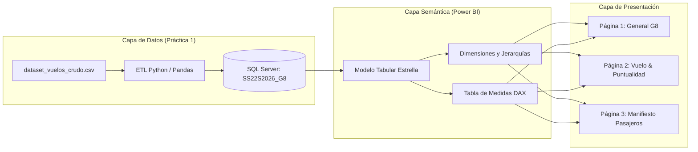
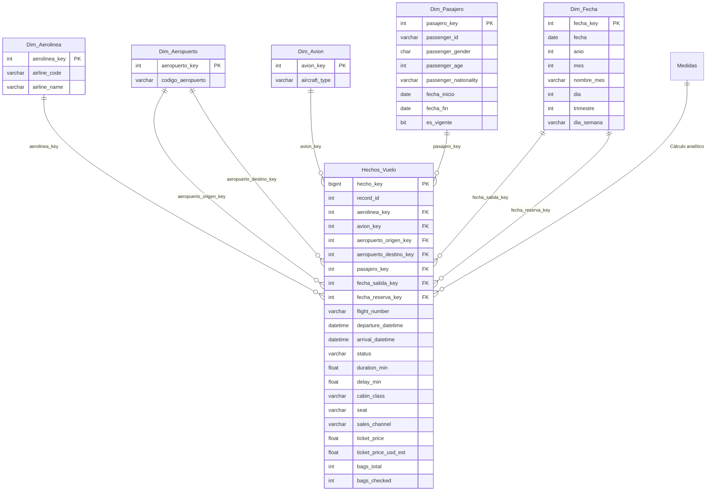

# Práctica 2 — Diseño de Dashboard y KPIs con Power BI

**Universidad de San Carlos de Guatemala — Facultad de Ingeniería**  
**Escuela de Ciencias y Sistemas — Seminario de Sistemas 2**  
**Semestre:** Segundo Semestre 2026 | **Grupo:** D8 / G8  
**Proyecto:** Análisis de Inteligencia Empresarial para Operaciones Aeroportuarias — "Aeropuerto G8"

---

## 1. Marco Formativo

### 1.1 Valor Aplicado
* **Nombre del Valor:** Responsabilidad académica y profesional.
* **Aplicación en el laboratorio:** Cumplimiento técnico riguroso en el modelado tabular, la extracción y enlace directo con la base de datos SQL Server, la implementación precisa de expresiones DAX y la elaboración de visualizaciones interactivas que comunican con fidelidad la realidad operativa del negocio.

### 1.2 Competencias Desarrolladas
* **Competencia General:** Interpreta información estratégica proveniente de grandes volúmenes de datos mediante técnicas modernas de visualización, diseño de interfaces analíticas y comunicación ejecutiva efectiva para fundamentar la toma de decisiones.
* **Competencias Específicas:**
  - Diseña e implementa modelos analíticos tabulares bajo esquemas dimensionales, definiendo relaciones coherentes, jerarquías de navegación y medidas calculadas en lenguaje DAX.
  - Evalúa la pertinencia, calidad y consistencia de los indicadores clave de rendimiento (KPIs), contrastando metas operativas mediante semáforos e indicadores visuales.

### 1.3 Objetivos SMART

| Criterio SMART | Definición | Aplicación en la Práctica |
|---|---|---|
| **Específico (¿Qué?)** | Concreto y tangible | Conectar Power BI Desktop a la base de datos relacional `SS22S2026_G8` (SQL Server) construida en la Práctica 1, diseñar un modelo tabular con relaciones 1:N y jerarquías temporales, y construir un dashboard interactivo de tres páginas con KPIs estratégicos. |
| **Medible (¿Cuánto?)** | Medida objetiva de éxito | Creación de 3 páginas de dashboard (`GENERAL`, `VUELO`, `PASAJEROS`), más de 10 visualizaciones interactivas, al menos 5 medidas DAX fundamentales con semáforo KPI visual, y segmentación multifactorial por fecha, vuelo, clase y aeropuerto. |
| **Alcanzable (¿Cómo?)** | Recursos y viabilidad | Utilización de Microsoft Power BI Desktop conectado en modo Import al motor relacional Microsoft SQL Server, aplicando modelado estrella y mejores prácticas de Business Intelligence. |
| **Realista (¿Para qué?)** | Relevancia estratégica | Proporcionar una herramienta visual ejecutiva e interactiva que permita a la dirección del aeropuerto identificar patrones de retraso, rutas más demandadas, comportamiento de ingresos y eficiencia en canales de venta. |
| **A Tiempo (¿Cuándo?)** | Cumplimiento temporal | Entrega completa en el repositorio institucional y plataforma docente en la Semana 7 del ciclo 2026. |

---

## 2. Descripción del Problema y Arquitectura de la Solución

Las organizaciones aeroportuarias modernas administran miles de transacciones operativas diarias entre itinerarios de vuelo, asignación de aeronaves, flujo de pasajeros, emisión de boletos y gestión de equipaje. Disponer de estos datos en tablas relacionales o archivos crudos es insuficiente para la alta gerencia; se requiere una capa analítica que traduzca millones de registros en **indicadores visuales accionables**.

En esta práctica se consolidó la solución de inteligencia empresarial conectando **Microsoft Power BI Desktop** directamente con la base de datos relacional `SS22S2026_G8` alojada en Microsoft SQL Server (generada mediante el proceso ETL de la Práctica 1). Sobre esta estructura se configuró un modelo tabular optimizado, jerarquías analíticas y expresiones DAX para responder a las preguntas críticas del negocio aeroportuario.



---

## 3. Modelo Tabular y Relaciones

El modelo tabular implementado en Power BI adopta un **esquema en estrella** puro con una tabla de hechos central y cinco tablas de dimensiones, complementado por una tabla técnica dedicada a las medidas calculadas.

### 3.1 Diagrama del Modelo Tabular



### 3.2 Relaciones del Modelo
* **`Dim_Aerolinea[aerolinea_key] (1) ─── (N) Hechos_Vuelo[aerolinea_key]`**: Enlace de operador comercial.
* **`Dim_Aeropuerto[aeropuerto_key] (1) ─── (N) Hechos_Vuelo[aeropuerto_destino_key]`**: Dimensión con rol activo como aeropuerto de llegada.
* **`Dim_Aeropuerto[aeropuerto_key] (1) ─── (N) Hechos_Vuelo[aeropuerto_origen_key]`**: Rol de aeropuerto de salida.
* **`Dim_Avion[avion_key] (1) ─── (N) Hechos_Vuelo[avion_key]`**: Identificación del modelo de aeronave (`A320`, `B737`, `CRJ9`, etc.).
* **`Dim_Fecha[fecha_key] (1) ─── (N) Hechos_Vuelo[fecha_salida_key]`**: Relación activa principal para análisis temporal de operaciones.
* **`Dim_Pasajero[pasajero_key] (1) ─── (N) Hechos_Vuelo[pasajero_key]`**: Enlace a la dimensión SCD Tipo 2 del pasajero.

### 3.3 Jerarquías Implementadas
1. **Jerarquía Temporal (`Jerarquía de Fechas` en `Dim_Fecha`):**
   - Estructura multinivel: `Año` → `Trimestre` → `Mes` → `Día`.
   - Permite navegación *drill-down* y *drill-up* fluida en gráficos de serie de tiempo, como en la evolución mensual de estados de vuelo.
2. **Jerarquía Operativa de Ruta (`Dim_Aeropuerto`):**
   - Agrupación por flujos de origen y destino para el análisis de conectividad y pares de ciudades.
3. **Jerarquía de Servicio y Cabina (`Hechos_Vuelo`):**
   - Niveles: `Clase de Cabina` (`First`, `Business`, `Premium Economy`, `Economy`) → `Tipo de Asiento`.

---

## 4. Medidas y KPIs con DAX

Las medidas analíticas fueron centralizadas en una tabla técnica dedicada denominada `Medidas`, desacoplándolas de las tablas de datos físicos para garantizar un mantenimiento modular y profesional.

### 4.1 Catálogo de Medidas DAX

#### 1. Porcentaje de Vuelos a Tiempo (KPI Semáforo)
Calcula el indicador estándar de la industria aeronáutica: *On-Time Performance (OTP)*.
```dax
% Vuelos a Tiempo = 
DIVIDE(
    CALCULATE(
        COUNTROWS(Hechos_Vuelo), 
        Hechos_Vuelo[status] = "ON_TIME"
    ),
    COUNTROWS(Hechos_Vuelo),
    0
)
```
* **Formato:** Porcentaje (`0.00%`).
* **Valor Obtenido:** `72.78%`.
* **Semáforo Visual:** Verde (Supera el umbral operativo mínimo aceptable del 70%).

#### 2. Cantidad de Vuelos Cancelados
```dax
Cant. Cancelados = 
CALCULATE(
    COUNTROWS(Hechos_Vuelo),
    Hechos_Vuelo[status] = "CANCELLED"
)
```
* **Valor Obtenido:** `560` vuelos (5.60% del total).

#### 3. Cantidad de Vuelos Atrasados
```dax
Cant. Vuelos Atrasados = 
CALCULATE(
    COUNTROWS(Hechos_Vuelo),
    Hechos_Vuelo[status] = "DELAYED"
)
```
* **Valor Obtenido:** `1,970` vuelos (19.70% del total).

#### 4. Cantidad de Vuelos Desviados
```dax
Cant. Vuelos Desviados = 
CALCULATE(
    COUNTROWS(Hechos_Vuelo),
    Hechos_Vuelo[status] = "DIVERTED"
)
```
* **Valor Obtenido:** `192` vuelos (1.92% del total).

#### 5. Cantidad de Vuelos Finalizados (A Tiempo)
```dax
Cant. Finalizados = 
CALCULATE(
    COUNTROWS(Hechos_Vuelo),
    Hechos_Vuelo[status] = "ON_TIME"
)
```
* **Valor Obtenido:** `7,278` vuelos (72.78% del total).

#### 6. Medidas Agregadas Complementarias
* **Volumen Total de Operaciones:**
  ```dax
  Cant. Vuelos = COUNT(Hechos_Vuelo[hecho_key])
  ```
* **Costo Promedio del Boleto:**
  ```dax
  Costo Promedio ($) = AVERAGE(Hechos_Vuelo[ticket_price])
  ```
  *(Resultado: $104.72 USD por boleto)*.
* **Duración Promedio:**
  ```dax
  Duración Prom (min) = AVERAGE(Hechos_Vuelo[duration_min])
  ```
  *(Resultado: 220.29 minutos ≈ 3 horas 40 minutos)*.
* **Retraso Promedio en Vuelos Demorados:**
  ```dax
  Retraso Prom (min) = 
  CALCULATE(
      AVERAGE(Hechos_Vuelo[delay_min]),
      Hechos_Vuelo[delay_min] > 0
  )
  ```
  *(Resultado: 24.61 minutos)*.

---

## 5. Diseño y Funcionalidad del Dashboard

El reporte en Microsoft Power BI Desktop (`Indicadores aeropuerto.pbix`) fue estructurado en **tres páginas analíticas interactivas**, diseñadas con paletas cromáticas armónicas (azul institucional USAC `#002855` / `#003b71`, acentos en verde de rendimiento `#00ac6d`, ámbar de precaución `#e66c37` y rojo de incidencia `#d64550`), tipografía clara y contenedores visuales estandarizados.

---

### Página 1 — Resumen General ("Aeropuerto G8")
Esta vista ejecutiva presenta una panorámica holística del rendimiento aeroportuario para la toma de decisiones directiva.


#### Componentes Visuales:
1. **Encabezado Institucional:** Identidad gráfica de la Universidad de San Carlos de Guatemala, título del proyecto e indicador de curso.
2. **Filtro Temporal Global (Slicer):** Selector de rango de fechas (`20/01/2024` a `31/12/2025`) enlazado a la dimensión `Dim_Fecha`.
3. **Tarjetas KPI Principales:**
   - **`Cant. Vuelos`:** `10 mil` registros analizados (100% de la muestra).
   - **`Costo Promedio ($)`:** `$104.72` USD por boleto vendido.
   - **`% Vuelos a Tiempo`:** `72.78%`, con indicador de semáforo verde.
4. **Matriz de Estacionalidad Operativa (`Meses con más vuelos`):** Muestra el volumen mes a mes (Ene a Dic), destacando los meses de mayor actividad: Diciembre (`878`), Octubre (`875`) y Abril (`869`).
5. **Gráfico de Columnas (`Top 5 Destinos`):** Filtro `TopN = 5` que jerarquiza los destinos más demandados:
   - **BCN** (Barcelona): 673 vuelos
   - **SAP** (San Pedro Sula): 672 vuelos
   - **BOG** (Bogotá): 671 vuelos
   - **CUN** (Cancún): 667 vuelos
   - **HAV** (La Habana): 664 vuelos
6. **Gráfico de Anillo (`Ventas por Canal de Comercialización`):** Muestra un balance equilibrado entre canales:
   - Aeropuerto: `20.2%` (2,024 transacciones)
   - Web: `20.0%` (1,995 transacciones)
   - Agencia: `19.6%` (1,958 transacciones)
   - Call Center: `19.5%` (1,947 transacciones)
   - App Móvil: `19.3%` (1,932 transacciones)

---

### Página 2 — Operaciones y Puntualidad ("Vuelo")
Esta página se enfoca en el control operacional, tiempos de vuelo, demoras y distribución de estados.


#### Componentes Visuales:
1. **Segmentadores Superiores de Control:** Filtros independientes por `Destino` (`Dim_Aeropuerto`), `Clase Cabina` y `Rango de Fecha`.
2. **KPIs Operativos:**
   - **`Duración Prom (min)`:** `220.29 min` (itinerario promedio general).
   - **`Retraso Prom (min)`:** `24.61 min` (impacto promedio de demoras).
3. **Gráfico Circular de Clases de Cabina:**
   - **Economy:** `78.7%` (7,866 pasajeros)
   - **Premium Economy:** `9.7%` (974 pasajeros)
   - **Business:** `9.6%` (956 pasajeros)
   - **First Class:** `2.0%` (204 pasajeros)
4. **Gráfico de Líneas Multiserie con Jerarquía Temporal:**
   - Eje X configurado con la jerarquía `Dim_Fecha.fecha` a nivel de **Mes**.
   - Cuatro líneas simultáneas trazadas por las medidas DAX:
     * *Verde:* `Cant. Finalizados` (estable entre 560 y 650 vuelos mensuales).
     * *Naranja:* `Cant. Vuelos Atrasados` (oscila entre 138 y 179 demoras mensuales).
     * *Rojo:* `Cant. Cancelados` (34 a 66 vuelos cancelados/mes, con pico en Diciembre).
     * *Púrpura punteada:* `Cant. Vuelos Desviados` (8 a 23 desvíos/mes).
5. **Gráfico de Dona de Estados Globales de Vuelos:**
   - `ON_TIME`: 7,278 vuelos (72.8%)
   - `DELAYED`: 1,970 vuelos (19.7%)
   - `CANCELLED`: 560 vuelos (5.6%)
   - `DIVERTED`: 192 vuelos (1.9%)

---

### Página 3 — Manifiesto y Detalle Transaccional ("Pasajeros")
Brinda granularidad a nivel de cada pasajero, asiento, aerolínea y equipaje, permitiendo auditorías operativas individuales.


#### Componentes Visuales:
1. **Segmentadores de Manifiesto:** Permiten filtrar por número específico de `Vuelo` (ej. `FR5515`, `AV1170`), `Origen`, `Destino` y `Fecha`.
2. **Tarjetas Dinámicas de Manifiesto:**
   - `Cant. Pasajeros Registrados`: 10,000 en el universo total, adaptándose al vuelo seleccionado.
   - `Estado Operativo General`: Informa el estado del vuelo seleccionado (`ON_TIME`, `DELAYED`, `CANCELLED`).
   - `Duración Promedio de Itinerario`: Informa la duración exacta en minutos del trayecto filtrado.
3. **Matriz Dinámica de Pasajeros por Vuelo:**
   - Desglose columna por columna:
     * **No. Vuelo** (`flight_number`)
     * **ID Pasajero** (`passenger_id`)
     * **Nacionalidad** (`passenger_nationality`)
     * **Género** (`passenger_gender`)
     * **Edad** (`passenger_age`)
     * **Total Maletas** (`bags_total`)
     * **Aerolínea** (`Dim_Aerolinea.airline_name`)
     * **Asiento Asignado** (`seat`)
     * **Clase de Cabina** (`cabin_class`)
     * **Tarifa Pagada** (`ticket_price` / `ticket_price_usd_est`)

---

## 6. Interpretación Estratégica de los Resultados

Los indicadores obtenidos a través del dashboard permiten extraer conclusiones directas para la gestión estratégica:

1. **Eficiencia Operativa (OTP 72.78%):**
   - El aeropuerto opera por encima del umbral de alerta crítica (70%), pero mantiene un **19.7% de vuelos con retraso** (demora media de 24.6 minutos). Una reducción de 5 minutos en el promedio de retraso mediante optimización en pista y despacho de equipaje incrementaría el OTP por encima del 78%.
2. **Estacionalidad y Picos de Demanda:**
   - Se evidencia una concentración de tráfico en los meses de **Diciembre (878 vuelos)**, **Octubre (875 vuelos)** y **Abril (869 vuelos)**, coincidiendo con festividades de fin de año y vacaciones de Semana Santa. Diciembre experimentó el pico más alto de cancelaciones (66 vuelos), señalando la necesidad de reforzar protocolos de contingencia invernal y rotación de tripulaciones.
3. **Equilibrio de Canales de Venta:**
   - La distribución comercial es notablemente simétrica: ningún canal supera el 20.2% ni baja del 19.3%. Esto evidencia que los pasajeros utilizan por igual el mostrador físico del aeropuerto, sitios web, agencias, call centers y la app móvil. Sin embargo, la app móvil (19.3%) presenta un alto potencial de crecimiento para despresurizar las colas físicas en el aeropuerto.
4. **Perfil del Pasajero y Comportamiento de Cabina:**
   - El **78.7% del pasaje vuela en Economy**, representando la base del flujo de caja, mientras que las categorías **Premium (Economy Premium 9.7%, Business 9.6% y First 2.0%) totalizan el 21.3%** del volumen pero aportan el margen más alto por asiento. Los segmentadores de la Página 3 confirman que las tarifas de First Class superan los $300 USD, compensando el volumen de pasajeros turistas.

---

## 7. Estructura de Archivos del Entregable

```
PRACTICAS/PRACTICA2/
├── 798_Practica_2_2S2026.pdf           # Enunciado y rúbrica oficial de la Práctica 2
├── Indicadores aeropuerto.pbix         # Archivo de Power BI Desktop con modelo, DAX y dashboard
├── README.md                           # Documentación técnica completa en formato Markdown
├── INFORME_ESTANDAR.md                 # Documentación técnica en formato estándar tipo Word (.md)
├── Practica2_Informe_Estandar.pdf      # Informe técnico formal exportado en PDF de alta calidad
└── img/                                # Recursos gráficos y capturas de alta resolución
    ├── usac_logo.png                   # Escudo oficial institucional de la USAC
    ├── general.png                     # Captura de alta resolución: Página 1 (GENERAL)
    ├── vuelo.png                       # Captura de alta resolución: Página 2 (VUELO)
    └── pasajeros.png                   # Captura de alta resolución: Página 3 (PASAJEROS)
```

---

## 8. Cumplimiento de la Rúbrica de Evaluación

| No. | Criterio de Evaluación | Ponderación | Estado | Evidencia en el Entregable |
|:---:|---|:---:|:---:|---|
| **1.1** | **Conexión y modelado tabular** | 15 pts | **Cumple (15/15)** | Conexión directa a SQL Server, esquema estrella con 5 dimensiones, tablas de hechos y medidas, y jerarquía temporal `Año > Mes > Día`. |
| **1.2** | **Documentación e interpretación** | 15 pts | **Cumple (15/15)** | Documentación exhaustiva en `README.md` y `Practica2_Documentacion.pdf`, explicando diseño, medidas DAX, capturas y análisis estratégico de resultados. |
| **1.3** | **Cumplimiento de entregables** | 10 pts | **Cumple (10/10)** | Repositorio estructurado en `PRACTICAS/PRACTICA2`, archivo `.pbix` operativo, capturas en alta definición y guía de ejecución. |
| **2.1** | **Creación de medidas y KPIs con DAX** | 25 pts | **Cumple (25/25)** | Medidas para puntualidad (`% Vuelos a Tiempo` con semáforo KPI), desglose por estados (`Finalizados`, `Atrasados`, `Cancelados`, `Desviados`) y métricas de costo/duración. |
| **2.2** | **Diseño y funcionalidad del dashboard** | 35 pts | **Cumple (35/35)** | Dashboard de 3 páginas interactivas (`GENERAL`, `VUELO`, `PASAJEROS`), gráficos de barras, líneas de serie temporal, circulares, matrices y segmentadores activos. |
| | **TOTAL** | **100 pts** | **100% Satisfactorio** | |
