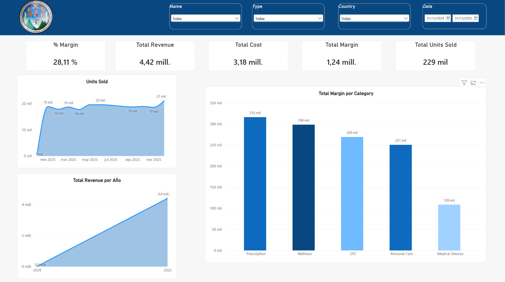
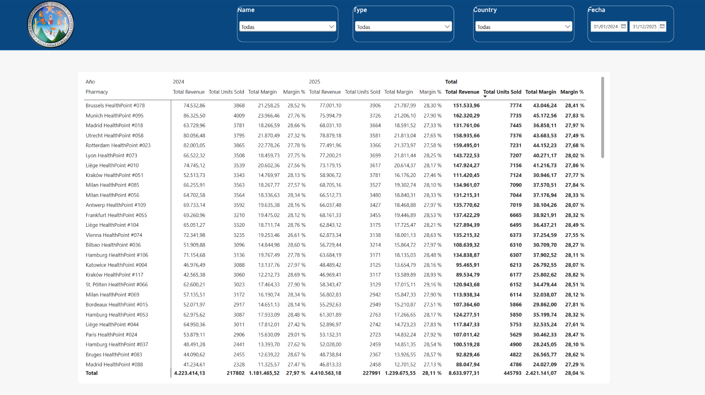

# Tarea #2 — Construcción de dashboard analítico en Power BI
**Universidad San Carlos de Guatemala — Facultad de Ingeniería — Ingeniería en Ciencias y Sistemas**
**Curso:** Seminario de Sistemas 2

---

## 1. Descripción del dataset

El dataset utilizado corresponde a datos de ventas de una cadena de farmacias, estructurado en modelo estrella con 4 tablas:

| Tabla | Descripción | Campos principales |
|---|---|---|
| **FactSales** | Tabla de hechos con las transacciones de venta | SalesID, DateKey, PharmacyID, ProductID, UnitsSold, RevenueEUR, CostEUR, MarginEUR, PromoFlag |
| **DimDate** | Dimensión de tiempo | DateKey, Date, Year, Quarter, MonthNumber, MonthName, YearMonth |
| **DimPharmacy** | Dimensión de farmacias | PharmacyID, PharmacyName, Country, Region, City, PharmacyType, OpenDate, StoreSizeBand, Latitude, Longitude |
| **DimProduct** | Dimensión de productos | ProductID, ProductName, Category, Brand, IsGeneric, PackSize, ListPriceEUR, StandardCostEUR, LaunchDate, IsDiscontinued |

Las relaciones se modelaron entre `FactSales` y cada dimensión mediante las claves `DateKey`, `PharmacyID` y `ProductID`, siguiendo un esquema estrella.

---

## 2. Transformaciones realizadas

- Verificación y corrección de tipos de datos (fechas, decimales, texto) en Power Query.
- Modelado de relaciones entre `FactSales` y las tablas de dimensión (`DimDate`, `DimPharmacy`, `DimProduct`).
- Creación de **columnas calculadas**:
  - `MarginPct` — margen porcentual por fila (`MarginEUR / RevenueEUR`).
  - `AvgPricePerUnit` — precio promedio por unidad.
  - `PriceVsCost` — diferencia entre precio de lista y costo estándar (DimProduct).
  - `StoreAgeYears` — antigüedad de cada farmacia (DimPharmacy).
- Creación de una tabla dedicada de **medidas** (`Medidas`), separando el cálculo del modelo físico de datos, con DAX como:
  - `Total Revenue`, `Total Cost`, `Total Margin`, `Total Units Sold`
  - `Margin %`
  - `Revenue LY` y `Revenue YoY %` (comparación interanual)
  - `% Sales with Promo`
  - `Active Pharmacies`, `Avg Revenue per Pharmacy`
  - `Generic Share %`

---

## 3. Capturas del dashboard

### Página 1 — Resumen Ejecutivo

Contiene:
- Tarjetas KPI (Total Revenue, Total Margin, % Margin, Total Units Sold, entre otras).
- Gráfico de líneas con la tendencia mensual de unidades vendidas.
- Gráfico de columnas comparativo.
- Segmentadores (slicers) por Nombre de farmacia, Tipo, País y Fecha.

### Página 2 — Farmacias con mayores ventas

Contiene:
- Tabla dinámica (matriz) con el ranking de farmacias por Revenue, Unidades Vendidas y Margen.
- Segmentadores por Nombre, Tipo, País y Fecha para filtrar el ranking de forma interactiva.

---

## 4. Interpretación de los KPIs presentados

- **Total Revenue / Total Margin:** permiten dimensionar el volumen de negocio y la rentabilidad global de la operación en el periodo analizado.
- **Margin %:** con un margen cercano al 28%, se identifica un nivel de rentabilidad estable a lo largo del periodo, sin variaciones drásticas entre años.
- **Revenue YoY %:** muestra el crecimiento o decrecimiento interanual de ingresos, útil para detectar tendencias de expansión o contracción del negocio.
- **Ranking de farmacias (matriz):** identifica las sucursales con mayor aporte a los ingresos totales, lo cual permite priorizar recursos, promociones o análisis de causas en las farmacias con bajo desempeño.
- **% Sales with Promo:** ayuda a entender qué proporción de las ventas están influenciadas por promociones, insumo clave para evaluar la efectividad de campañas comerciales.

En conjunto, estos indicadores permiten a la organización identificar sus farmacias y periodos de mayor rentabilidad, apoyando la toma de decisiones estratégicas sobre expansión, promociones y control de costos.
