# Tarea 1 — Limpieza y Análisis Inicial de Datos con Python y Pandas

**Universidad San Carlos de Guatemala — Facultad de Ingeniería**
**Ingeniería en Ciencias y Sistemas — Seminario de Sistemas 2**
**Grupo:** 8

---

## Integrantes y participación

| Integrante | Carné | Participación |
|---|---|---|
| Diego Debroy | 202101923 | Limpieza de datos, análisis exploratorio y documentación — trabajo colaborativo en todas las etapas del proyecto. |
| Pablo Alejandro Marroquín Cutz | 202200214 | Limpieza de datos, análisis exploratorio y documentación — trabajo colaborativo en todas las etapas del proyecto. |
| Carlos Estuardo Monterroso Santos | 201903767 | Limpieza de datos, análisis exploratorio y documentación — trabajo colaborativo en todas las etapas del proyecto. |

Los tres integrantes participaron de forma conjunta en el desarrollo del notebook (limpieza y transformación de
datos, construcción de tablas pivote y visualizaciones) y en la redacción de este documento.

---

## 1. Dataset utilizado

| | |
|---|---|
| **Nombre del archivo** | `dataset_sucio.csv` |
| **Origen** | Dataset provisto por la cátedra para la actividad |
| **Contenido** | Registro de clientes y su gasto asociado a una categoría de compra |
| **Dimensiones originales** | 5,000 filas × 7 columnas |
| **Columnas** | `id_cliente`, `nombre`, `genero`, `fecha_registro`, `gasto_q`, `ciudad`, `categoria` |

---

## 2. Descripción del proceso de limpieza aplicado

Todo el proceso está documentado paso a paso, con código y salidas, en
[`Tarea1_Limpieza_Analisis.ipynb`](Tarea1_Limpieza_Analisis.ipynb). A continuación un resumen del flujo aplicado:

### 2.1 Diagnóstico inicial

Antes de modificar cualquier dato se generó un diagnóstico de calidad (tipos de dato, nulos, cardinalidad y
duplicados) para establecer una línea base medible. Se identificaron los siguientes problemas:

- **100 filas duplicadas exactas** (2% del total).
- **Dos formatos de fecha distintos** conviviendo en la misma columna: `AAAA-MM-DD` y `DD/MM/AAAA`.
- **Dos convenciones de separador decimal** en `gasto_q`: coma (`"373,33"`) y punto (`"371.80"`).
- **Texto sin estandarizar** en `nombre`, `genero`, `ciudad` y `categoria`: espacios al inicio/fin, espacios dobles
  internos y mezcla de mayúsculas/minúsculas (p. ej. `" m "`, `"M"`, `"RETAIL"`, `"retail"`, `"  Antigua"`).
- **Valores faltantes**: `genero` (2.3%), `ciudad` (4.5%) y `gasto_q` (10.1%).

### 2.2 Transformaciones aplicadas

| Paso | Acción |
|---|---|
| **Eliminación de duplicados** | `drop_duplicates()` sobre el dataset completo → se eliminaron 100 filas. Se validó que ningún `id_cliente` quedara duplicado. |
| **Estandarización de texto** | Se recortaron espacios, se colapsaron espacios internos múltiples y se unificó el formato: `nombre`/`ciudad`/`categoria` → *Title Case*; `genero` → `Masculino` / `Femenino`. |
| **Estandarización de fechas** | Se interpretaron ambos formatos (`%Y-%m-%d` y `%d/%m/%Y`) y se convirtieron a `datetime64` (ISO 8601). |
| **Estandarización numérica** | Se interpretó el separador decimal (coma o punto) de `gasto_q` y se convirtió a `float`. |
| **Tratamiento de nulos — `genero`/`ciudad`** | Imputados con la etiqueta `"No especificado"`, preservando el registro sin inventar un valor categórico que no puede inferirse. |
| **Tratamiento de nulos — `gasto_q`** | Imputados con la **mediana de gasto por categoría** (robusta a outliers y sensible a que el gasto varía según el tipo de compra). |
| **Validación de tipos** | `id_cliente` → `int`; `genero`/`ciudad`/`categoria` → `category`; `fecha_registro` → `datetime64`; `gasto_q` → `float`. |

### 2.3 Resultado

El dataset limpio quedó con **4,900 filas**, **0 valores nulos**, **0 duplicados** y tipos de dato consistentes.
Se exportó en dos formatos: [`dataset_limpio.csv`](dataset_limpio.csv) y `dataset_limpio.parquet`.

---

## 3. Capturas de las tablas y visualizaciones generadas

### 3.1 Diagnóstico de calidad — Antes vs. Después

<table>
<tr><td align="center"><b>ANTES</b></td><td align="center"><b>DESPUÉS</b></td></tr>
<tr>
<td>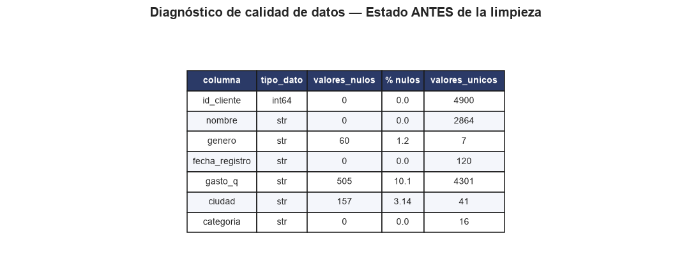</td>
<td>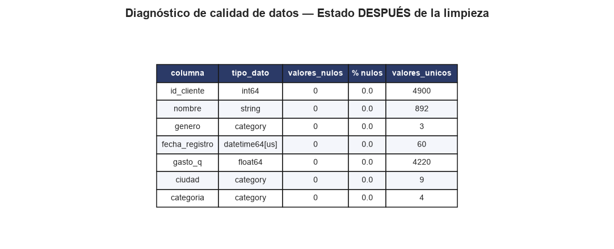</td>
</tr>
</table>

**Resumen comparativo del impacto de la limpieza:**

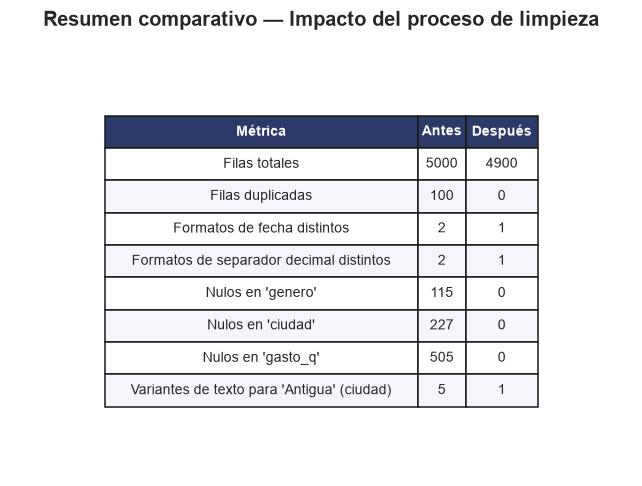

### 3.2 Evidencia del problema de texto sin estandarizar

Antes de limpiar el texto, una misma ciudad real ("Antigua") se registraba de 5 formas distintas, lo que fragmenta
cualquier análisis agregado:

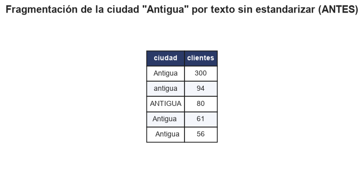

### 3.3 Tablas tipo pivote (dataset limpio)

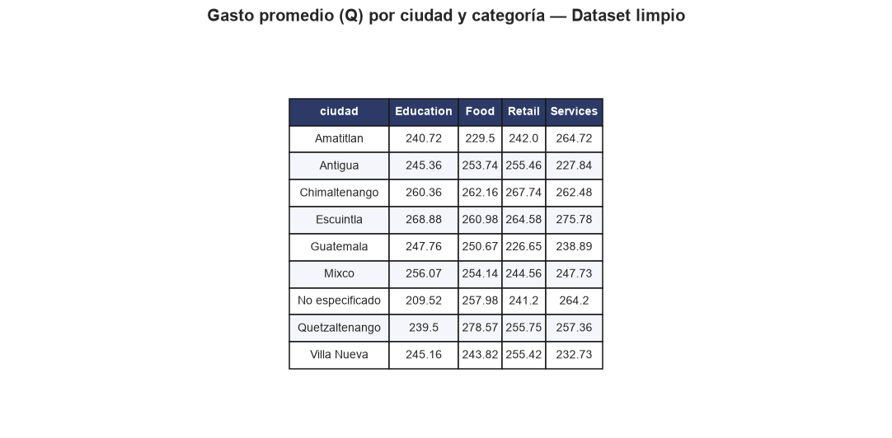

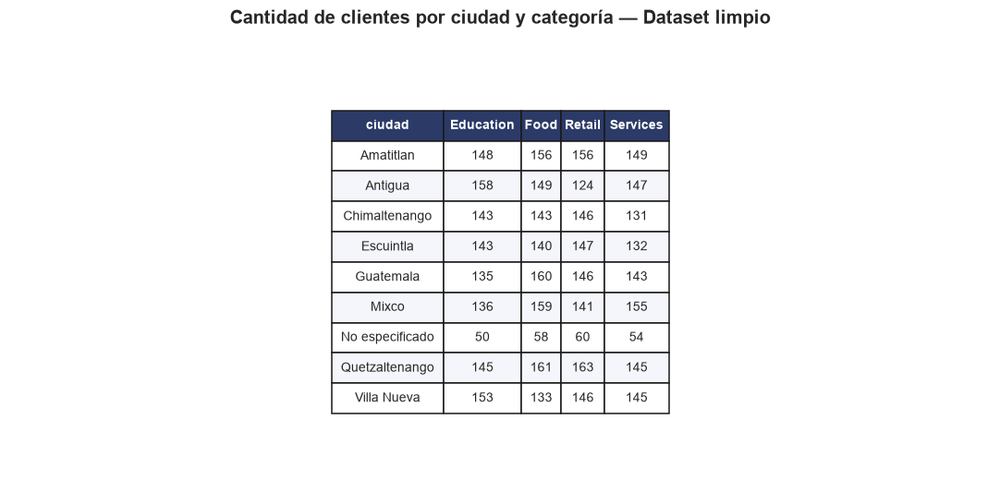


### 3.4 Visualizaciones

| | |
|---|---|
| 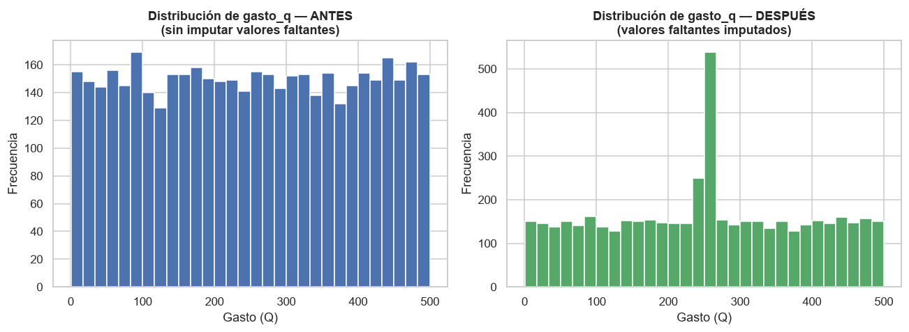 | 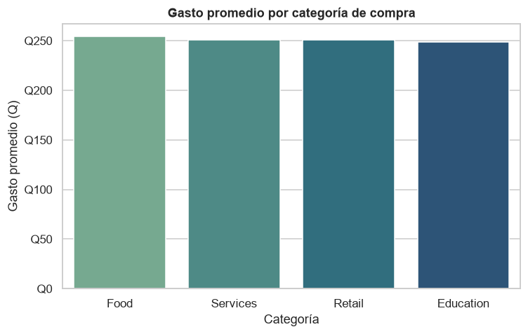 |
| 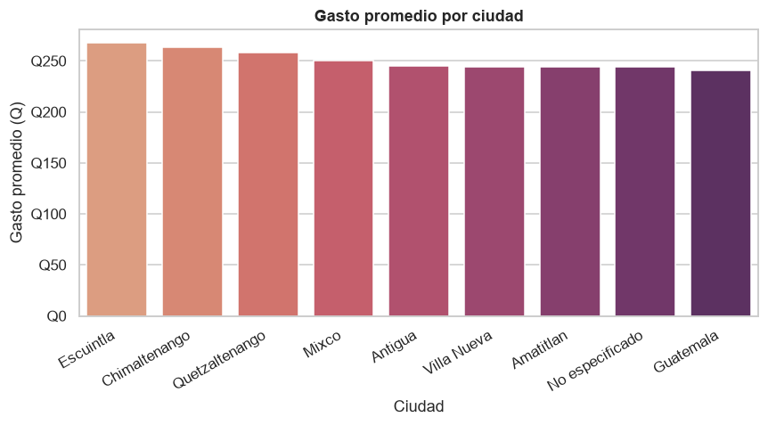 | 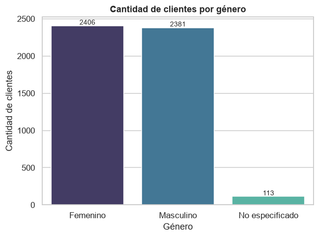 |
| 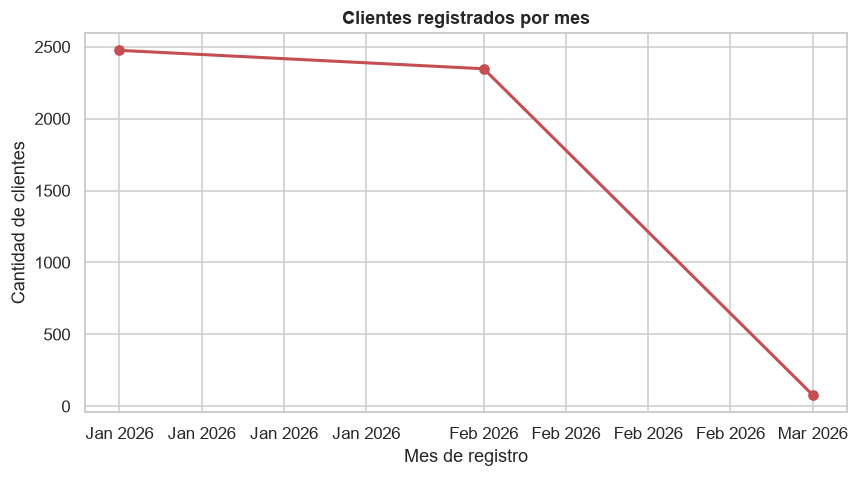 | 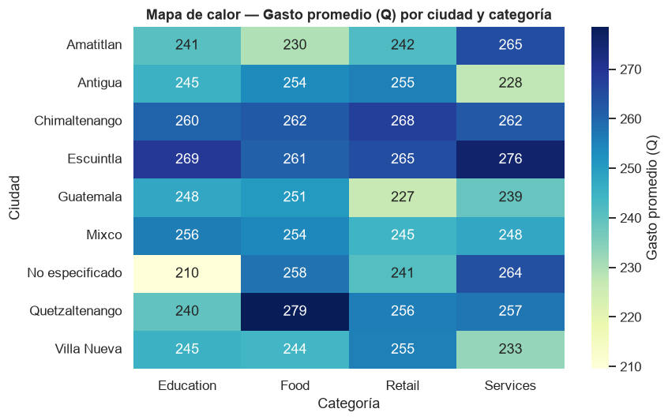 |

---

## 4. Interpretación de los resultados

- **Duplicados y calidad estructural:** el 2% de filas duplicadas y las inconsistencias de formato (fechas,
  decimales, texto) no son errores aleatorios menores: si no se corrigen, distorsionan directamente cualquier
  agregación. El caso de "Antigua" fragmentada en 5 variantes es la evidencia más clara: sin limpieza, esa ciudad
  aparentaría tener una participación mucho menor de la que realmente tiene.

- **Valores faltantes:** los nulos no se concentran en una sola columna ni parecen sistemáticos (2.3%–10.1%,
  variables distintas), lo que es consistente con un problema de captura de datos más que con un sesgo de
  muestreo. Se optó por **conservar todas las filas** en lugar de eliminarlas, usando imputación categórica
  explícita (`"No especificado"`) y numérica por mediana segmentada, para no perder información válida en las
  demás columnas de cada registro.

- **Efecto de la imputación en la distribución:** el histograma de `gasto_q` muestra un pico adicional alrededor de
  Q245–Q270 después de la limpieza. Es el efecto esperado de imputar ~505 valores con la mediana por categoría: se
  evita inventar datos, pero se concentra artificialmente esa fracción de registros en un rango estrecho. Se deja
  documentado como una limitación conocida del método.

- **Relación entre variables:** tanto la tabla pivote como el mapa de calor muestran que el gasto promedio se mueve
  en un rango moderado (Q210–Q279) entre ciudades y categorías, sin combinaciones que se disparen por encima del
  resto. Esto sugiere que, en este dataset, **ni la ciudad ni la categoría de compra son factores determinantes del
  monto gastado**.

- **Género:** la distribución está prácticamente balanceada entre Femenino (2,406) y Masculino (2,381), con un
  grupo "No especificado" (113 clientes, ~2.3%) que se mantiene en un rango de gasto similar al resto, indicando
  que la imputación no introdujo sesgo por esta variable.

- **Serie temporal:** el volumen de registros por mes se mantiene estable en el periodo observado
  (enero–febrero 2026), sin picos ni caídas atípicas.

---

## 5. Estructura del repositorio

```
SS22S2026_G8/
└── Tarea1/
    ├── Tarea1_Limpieza_Analisis.ipynb   # Notebook completo (código + salidas + interpretaciones)
    ├── dataset_sucio.csv                # Dataset original, sin modificar
    ├── dataset_limpio.csv               # Dataset depurado (salida del proceso)
    ├── dataset_limpio.parquet           # Dataset depurado en formato Parquet
    ├── README.md                        # Este documento
    └── imgs/                            # Capturas de tablas y gráficas generadas por el notebook
```

## 6. Cómo reproducir el análisis

```bash
pip install pandas numpy matplotlib seaborn jupyter nbformat pyarrow
jupyter nbconvert --to notebook --execute --inplace Tarea1_Limpieza_Analisis.ipynb
```

El notebook regenera automáticamente el dataset limpio y todas las imágenes de la carpeta `imgs/`.
